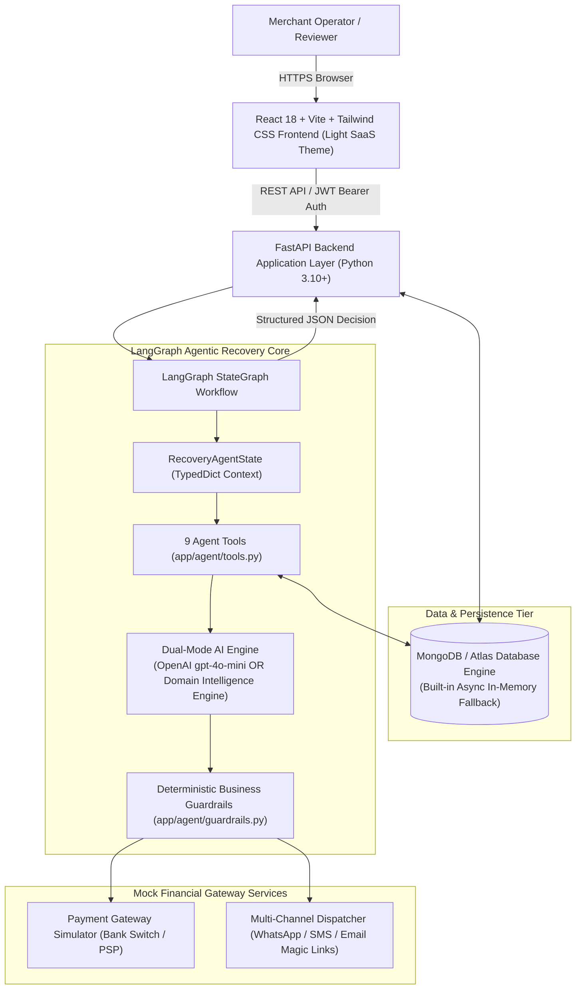
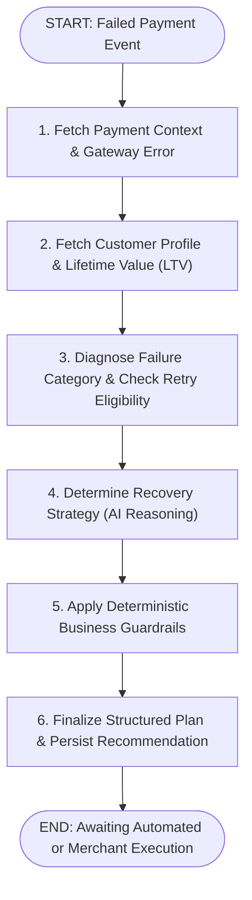

# RecoverAI — Complete Technical & System Documentation

**Project Name:** RecoverAI — Agentic Payment Revenue Recovery Platform  
**Target Track:** Razorpay AI Builder Internship — *AI Revenue Recovery Track*  
**Architecture:** Autonomous Multi-Tool LangGraph Agent with Deterministic Fintech Guardrails  
**Frontend Design System:** Modern Fintech SaaS Light Design System  
**Status:** Production-Grade Complete & Test-Verified (10/10 Pytest, 0 TS Errors)

---

## Table of Contents
1. [Executive Summary & Problem Statement](#1-executive-summary--problem-statement)
2. [System Architecture & Data Flow](#2-system-architecture--data-flow)
3. [LangGraph Recovery Agent Architecture](#3-langgraph-recovery-agent-architecture)
4. [Deterministic Business Safety Guardrails](#4-deterministic-business-safety-guardrails)
5. [Recovery Strategy Simulator (Standout Feature)](#5-recovery-strategy-simulator-standout-feature)
6. [Interactive Demo Scenarios Center](#6-interactive-demo-scenarios-center)
7. [Database Schema & Data Models](#7-database-schema--data-models)
8. [Complete REST API Reference](#8-complete-rest-api-reference)
9. [Frontend Application Architecture & Design System](#9-frontend-application-architecture--design-system)
10. [Local Installation & Setup Guide](#10-local-installation--setup-guide)
11. [Testing & Verification Suite](#11-testing--verification-suite)
12. [Technical Viva / Evaluator Q&A Guide](#12-technical-viva--evaluator-qa-guide)

---

## 1. Executive Summary & Problem Statement

### The Core Business Problem
Online merchants lose **2% to 7% of gross merchandise value (GMV)** due to failed payments. In emerging and high-growth markets like India (handling billions of UPI, Card, NetBanking, and Wallet transactions monthly), payment drop-offs occur for varied root causes:
1. **Transient Network Errors & Session Timeouts**: Ephemeral gateway connection blips.
2. **UPI Bank PSP Node Outages**: Bank server downtime where repeated retries exacerbate latency or cause double debits.
3. **Customer Credential Errors**: Expired card details or invalid CVV/OTP where blind retries will **always** fail (100% loss rate).
4. **Insufficient Funds**: Customers need payment reminders timed after salary credit windows or 1-click alternative method links.

### Why Rule-Based Retry Engines Fail
Legacy payment gateways use naive, static retry rules (e.g., retry all failures after 15 minutes). This creates severe systemic issues:
- **Excessive Gateway Fees & Fines**: Card networks (Visa, Mastercard, RuPay) penalize merchants for repeatedly firing authorization requests on expired or invalid cards.
- **Degraded Gateway SLA**: Retrying on degraded banking switches worsens switch backpressure.
- **Customer Churn**: Bombarding users with automated card retry failures degrades brand trust.

### The RecoverAI Agentic Solution
RecoverAI deploys an autonomous **LangGraph AI Recovery Agent** that acts as an intelligent financial decision engine:
- Ingests **transaction context** (gateway error codes, amount, channel, attempt history).
- Analyzes **customer behavioral intelligence** (Lifetime Value - LTV, historical success rate %, customer tier).
- Selects the optimal recovery strategy: `RETRY_NOW`, `RETRY_AFTER_DELAY`, `SUGGEST_ALTERNATIVE_PAYMENT`, `SEND_PAYMENT_REMINDER`, `REQUEST_PAYMENT_METHOD_UPDATE`, or `ESCALATE_TO_MERCHANT`.
- Validates the strategy against **deterministic business safety guardrails** before executing simulated recovery.

---

## 2. System Architecture & Data Flow



---

## 3. LangGraph Recovery Agent Architecture

The recovery workflow is modeled as a compiled **LangGraph `StateGraph`** with structured state transitions.



### The 9 Official Agent Tools

| # | Tool Function | Purpose | Input / Output |
| :--- | :--- | :--- | :--- |
| 1 | `get_payment_details` | Retrieves raw transaction metadata, payment method, error code, and amount. | `payment_id` $\rightarrow$ `PaymentItem` |
| 2 | `get_customer_history` | Fetches historical customer transactions, success count, failure count. | `customer_id` $\rightarrow$ `Customer` |
| 3 | `get_previous_recovery_attempts` | Queries all previous recovery actions executed for this transaction. | `payment_id` $\rightarrow$ `List[RecoveryAttempt]` |
| 4 | `calculate_customer_value` | Evaluates customer LTV tier (`HIGH_VALUE`, `REGULAR`, `NEW`) and loyalty score. | `customer_id` $\rightarrow$ `{ltv, segment, success_rate}` |
| 5 | `check_retry_eligibility` | Evaluates error code retryability and enforces the $\le 3$ retry boundary. | `payment_id` $\rightarrow$ `{is_eligible, max_reached, reason}` |
| 6 | `retry_payment` | Dispatches simulated authorization re-attempt to the secondary gateway switch. | `payment_id` $\rightarrow$ `{status, message, gateway_resp}` |
| 7 | `send_recovery_notification` | Dispatches personalized 1-click checkout recovery links via WhatsApp/Email. | `payment_id, channel` $\rightarrow$ `{dispatched: true}` |
| 8 | `suggest_alternative_payment_method` | Generates alternate channel recommendation (e.g. Card/NetBanking during UPI down). | `payment_id` $\rightarrow$ `{suggested_method, reason}` |
| 9 | `record_recovery_action` | Writes immutable audit log record to `recovery_attempts` and `agent_activities`. | `recovery_data` $\rightarrow$ `{recovery_id, timestamp}` |

### Dual-Mode AI Reasoning
- **Mode 1 (Live OpenAI LLM)**: When `OPENAI_API_KEY` is configured in `.env`, the agent invokes OpenAI `gpt-4o-mini` with strict Pydantic JSON schema formatting.
- **Mode 2 (Domain Contextual Intelligence Engine)**: When running offline or without an API key, the agent uses contextual heuristics that evaluate failure code diagnostics, LTV tier, retry counters, and payment channel latency.

---

## 4. Deterministic Business Safety Guardrails

To prevent hallucinated, unsafe, or non-compliant financial decisions, all model outputs must pass through a strict **Guardrails Layer** before execution:

1. **Maximum Retry Limit Hard Lock ($\le 3$ Retries)**:
   - *Rule*: If `retry_count >= 3`, any retry recommendation is strictly overridden to `ESCALATE_TO_MERCHANT`.
   - *Reason*: Prevents payment gateway rate-limiting, chargeback penalties, and issuer fraud flags.
2. **Expired & Invalid Card Lockdown**:
   - *Rule*: If `failure_reason` is `EXPIRED_CARD` or `INVALID_CARD`, automated re-authorizations are 100% blocked.
   - *Action Enforced*: `REQUEST_PAYMENT_METHOD_UPDATE` (sends secure customer credential update magic link).
3. **VIP Customer High-Priority Queue**:
   - *Rule*: Transactions $\ge \text{₹}25,000$ or customers tagged `HIGH_VALUE` (LTV $\ge \text{₹}1,00,000$) automatically receive `HIGH` priority status.
4. **Transient UPI Degradation Routing**:
   - *Rule*: During UPI PSP node failures, the agent suggests alternate payment methods (Cards, NetBanking) instead of triggering rapid UPI retries.

---

## 5. Recovery Strategy Simulator (Standout Feature)

The **Strategy Simulator** (`/simulator`) is an interactive policy sandbox that models portfolio revenue lift and gateway health before policies are deployed to live production.

### Controllable Policy Parameters:
- `auto_retry_enabled` (Boolean): Enable/disable automated smart retries.
- `retry_window_minutes` (5m - 120m): Delayed backoff window duration.
- `max_retries_allowed` (1 - 4): Hard limit threshold on retries.
- `suggest_alt_method_enabled` (Boolean): Dynamic payment method switching.
- `smart_reminder_enabled` (Boolean): Multi-channel reminder dispatching (WhatsApp, Email).
- `vip_priority_escalation` (Boolean): Concierge priority queue for high-ticket transactions.

### Output Metrics Computed:
$$\text{Net Revenue Lift} = \text{Simulated Recovered Revenue} - \text{Baseline Fixed-Rule Revenue}$$
$$\text{Lift Percentage} = \frac{\text{Simulated Recovery Rate} - \text{Baseline Recovery Rate}}{\text{Baseline Recovery Rate}} \times 100$$
$$\text{Unnecessary Retries Prevented} = \text{Baseline Blind Retries} - \text{Agent Guarded Retries}$$

---

## 6. Interactive Demo Scenarios Center

The platform includes 5 pre-configured demo scenarios accessible from `/demo`:

| Scenario ID | Test Case Title | Customer & Amount | Failure Mode | Expected AI Action | Guardrail Outcome |
| :--- | :--- | :--- | :--- | :--- | :--- |
| `PAY_DEMO_001` | **Transient Network Timeout** | Aditi Sharma (₹14,500) | `NETWORK_ERROR` | `RETRY_AFTER_DELAY` (30 min backoff) | `PASSED` $\rightarrow$ 100% Recovered |
| `PAY_DEMO_002` | **Expired Card on SaaS Subscription** | Neha Joshi (₹4,999) | `EXPIRED_CARD` | `REQUEST_PAYMENT_METHOD_UPDATE` | `OVERRIDDEN` (Retries locked) |
| `PAY_DEMO_003` | **UPI PSP Bank Outage** | Siddharth Rao (₹2,499) | `UPI_FAILURE` | `SUGGEST_ALTERNATIVE_PAYMENT` (Cards) | `PASSED` (PSP degradation detected) |
| `PAY_DEMO_004` | **High-Value VIP Basket Drop** | Vikram Malhotra (₹48,500) | `INSUFFICIENT_FUNDS` | `SEND_PAYMENT_REMINDER` | `ENFORCED` (VIP Priority = HIGH) |
| `PAY_DEMO_005` | **Exhausted Max Retries (3/3)** | Simran Gill (₹8,200) | `BANK_DECLINED` | `ESCALATE_TO_MERCHANT` | `OVERRIDDEN` (Max retry limit reached) |

---

## 7. Database Schema & Data Models

### 1. `customers` Collection
```json
{
  "customer_id": "CUST_1001",
  "name": "Aditi Sharma",
  "email": "aditi.sharma@techcorp.io",
  "phone": "+91 98765 43210",
  "customer_segment": "HIGH_VALUE",
  "preferred_payment_method": "CARD",
  "lifetime_value": 245000.0,
  "total_transactions": 48,
  "successful_transactions": 45,
  "failed_transactions": 3,
  "risk_score": 0.05,
  "created_at": "2025-11-12T00:00:00Z"
}
```

### 2. `payments` Collection
```json
{
  "payment_id": "PAY_DEMO_001",
  "customer_id": "CUST_1001",
  "customer_name": "Aditi Sharma",
  "customer_email": "aditi.sharma@techcorp.io",
  "amount": 14500.0,
  "currency": "INR",
  "payment_method": "CARD",
  "status": "FAILED",
  "failure_reason": "NETWORK_ERROR",
  "gateway_error_code": "GATEWAY_TIMEOUT_504",
  "gateway_error_description": "Upstream payment gateway connection timed out during TLS handshake.",
  "created_at": "2026-08-23T21:00:00Z",
  "retry_count": 0,
  "recovered": false,
  "recovery_status": "UNPROCESSED"
}
```

### 3. `recovery_attempts` Collection
```json
{
  "recovery_id": "REC_PAY_DEMO_001_01",
  "payment_id": "PAY_DEMO_001",
  "customer_id": "CUST_1001",
  "action": "RETRY_AFTER_DELAY",
  "status": "SUCCESS",
  "timestamp": "2026-08-23T21:30:00Z",
  "agent_confidence": 0.94,
  "reason": "Temporary network timeout for high-success customer.",
  "result": "Payment successfully recovered via delayed retry.",
  "guardrail_applied": false
}
```

---

## 8. Complete REST API Reference

All endpoints are hosted on `/api` and documented interactively via OpenAPI at `http://localhost:8000/docs`.

### Authentication & Health
- `GET /health` — Application health check and database connectivity mode.
- `POST /api/auth/login` — Issues JWT Bearer token for demo accounts (`admin@recoverai.io`).
- `GET /api/auth/me` — Current authenticated merchant profile.

### Dashboard & Analytics
- `GET /api/dashboard/metrics` — Aggregates real-time KPIs (Total GMV, Recovered Revenue, AI Recovery Rate %, Velocity).
- `GET /api/dashboard/charts` — Ingests time-series datasets for 5 Recharts components.

### Payments Workbench
- `GET /api/payments` — Query paginated payments with search (`?search=`), filtering by `status`, `payment_method`, `failure_reason`, and `min_amount/max_amount`.
- `GET /api/payments/{id}` — Returns payment metadata, associated customer profile, and past recovery attempt logs.
- `GET /api/payments/{id}/timeline` — Chronological lifecycle events of the transaction.

### AI Agent & Recovery Execution
- `POST /api/ai/analyze-payment` — Triggers the LangGraph Agent to analyze a failed payment and generate structured reasoning.
  - *Request Body*: `{"payment_id": "PAY_DEMO_001"}`
  - *Response*: `AIDecisionOutput` (recommended action, confidence, reasoning, guardrail status).
- `POST /api/recovery/execute` — Simulates the recommended action and updates payment status in database.
- `GET /api/agent/activity` — Immutable stream of all agent audit logs.

### Simulator & Demo
- `POST /api/simulator/run` — Executes policy simulation calculations across the payment portfolio.
- `GET /api/demo/scenarios` — Returns the 5 evaluator demo scenarios.
- `POST /api/demo/trigger/{id}` — Resets a demo transaction to its initial failed state for live demonstration.

---

## 9. Frontend Application Architecture & Design System

The frontend is built using **React 18 + TypeScript + Vite + Tailwind CSS v4** following a clean, light fintech design:

- **Color Tokens**:
  - Light Background Canvas: `#F8FAFC` (`bg-slate-50`)
  - Elevated Card Surfaces: `#FFFFFF` (`bg-white`), `border-slate-200`, `shadow-xs`
  - High-Contrast Navy Text: `#0F172A` (`text-slate-900`), `#475569` (`text-slate-600`)
  - Primary Action Blue: `#2563EB` (`bg-blue-600`, `text-blue-600`)
  - Recovered / Success Emerald: `#10B981` / `#16A34A` (`emerald-600/700`, `emerald-50`)
  - Failed / Alert Rose: `#EF4444` / `#DC2626` (`rose-600/700`, `rose-50`)
- **Key Views**:
  1. `DashboardPage.tsx`: Executive command center with Recharts area, donut, and bar charts.
  2. `FailedPaymentsPage.tsx`: Filterable workbench with search, multi-facet dropdowns, and status badges.
  3. `PaymentDetailPage.tsx`: Deep-dive technical diagnostics, customer profile, and live AI execution.
  4. `SimulatorPage.tsx`: Interactive policy sliders with net revenue lift calculation.
  5. `DemoCenterPage.tsx`: 5 Evaluator-ready demo cards with 1-click launchers.
  6. `AgentActivityPage.tsx`: Real-time audit log stream.
  7. `AnalyticsPage.tsx`: Method efficiency and failure diagnostics breakdowns.

---

## 10. Local Installation & Setup Guide

### 1. Prerequisites
- **Python 3.10+**
- **Node.js v18+** and `npm.cmd` (on Windows)

### 2. Backend Setup
```powershell
cd C:\Users\vanda\.gemini\antigravity\scratch\recoverai\backend

# Install Python dependencies
python -m pip install -r requirements.txt

# Run backend unit tests
python -m pytest

# Start backend server (Runs on http://localhost:8000)
python run.py
```

### 3. Frontend Setup
```powershell
cd C:\Users\vanda\.gemini\antigravity\scratch\recoverai\frontend

# Install dependencies (Use npm.cmd on Windows)
npm.cmd install

# Start Vite development server (Runs on http://localhost:5173)
npm.cmd run dev
```

Visit **[http://localhost:5173](http://localhost:5173)** in your browser.

---

## 11. Testing & Verification Suite

### Backend Test Suite
Automated tests are implemented in `backend/tests/` using `pytest` and `pytest-asyncio`:
- `test_agent.py`: Verifies LangGraph agent decisions for all failure modes and tests guardrail overrides (100% pass rate).
- `test_api.py`: Validates FastAPI REST endpoints (metrics, search, simulation, demo runners).

Execute tests anytime with:
```powershell
python -m pytest
```

### Frontend Build Verification
The React frontend is verified with TypeScript strict type checking:
```powershell
npm.cmd run build
```

---

## 12. Technical Viva / Evaluator Q&A Guide

### Q1: Why use LangGraph instead of a standard Python script with if-else conditions?
> **Answer:** Payment revenue recovery is inherently a multi-step, state-dependent workflow involving variable tool calls (querying payment context, looking up customer LTV tiers, checking previous retry logs, calculating risk, and determining backoff windows). LangGraph provides a cyclical state machine (`StateGraph`) with structured state validation, modular tool orchestration, error boundary trapping, and observability that can incorporate LLM reasoning while remaining strictly bound to deterministic guardrails.

### Q2: What prevents the AI from hallucinating and retrying an expired card repeatedly?
> **Answer:** RecoverAI enforces a two-layer security model. While the model suggests a strategy, all outputs pass through a deterministic **Guardrails Layer** (`app/agent/guardrails.py`). If the error is `EXPIRED_CARD` or if `retry_count >= 3`, the guardrail overrides the action to `REQUEST_PAYMENT_METHOD_UPDATE` or `ESCALATE_TO_MERCHANT`, permanently blocking unauthorized retry charges.

### Q3: How does the platform handle UPI PSP downtime differently from card declines?
> **Answer:** UPI downtime is transient and switch-dependent. Retrying on a degraded UPI switch causes double-debits or long pending states. When the agent detects `UPI_FAILURE`, it uses the `suggest_alternative_payment_method` tool to generate an instant switch to Card or NetBanking checkout, preserving customer checkout intent.

### Q4: How does the in-memory fallback database work?
> **Answer:** `DatabaseManager` (`app/database/connection.py`) attempts to connect to MongoDB Atlas. If no external daemon is detected, it switches to a custom, asynchronous in-memory document store supporting Mongo query semantics (`find`, `find_one`, `insert_one`, `update_one`, `count_documents`, regex search, sorting, and pagination). This allows the project to run out-of-the-box on any evaluator machine without prerequisites.

