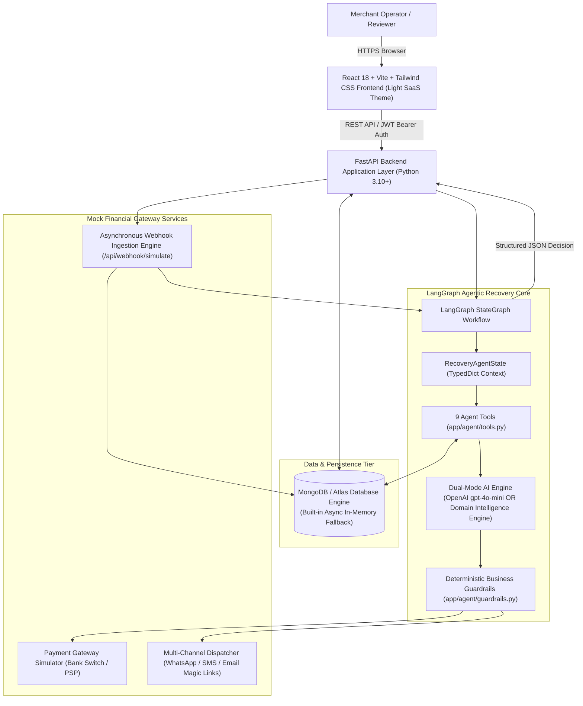

# RecoverAI — Complete Technical & System Documentation

**Project Name:** RecoverAI — Agentic Payment Revenue Recovery Platform  
**Target Track:** Razorpay AI Builder Internship — *AI Revenue Recovery Track*  
**Architecture:** Autonomous Multi-Tool LangGraph Agent with Deterministic Fintech Guardrails  
**Frontend Design System:** Modern Fintech SaaS Light Design System  
**Status:** Production-Grade Complete & Test-Verified (12/12 Pytest, 0 TS Errors)

---

## Table of Contents
1. [Executive Summary & Problem Statement](#1-executive-summary--problem-statement)
2. [System Architecture & Data Flow](#2-system-architecture--data-flow)
3. [LangGraph Recovery Agent Architecture](#3-langgraph-recovery-agent-architecture)
4. [Deterministic Business Safety Guardrails & Visual Override UI](#4-deterministic-business-safety-guardrails--visual-override-ui)
5. [Recovery Strategy Simulator (Standout Feature)](#5-recovery-strategy-simulator-standout-feature)
6. [Interactive Demo Scenarios Center & Batch Evaluator](#6-interactive-demo-scenarios-center--batch-evaluator)
7. [Asynchronous Gateway Webhook Simulation](#7-asynchronous-gateway-webhook-simulation)
8. [Database Schema & Data Models](#8-database-schema--data-models)
9. [Complete REST API Reference](#9-complete-rest-api-reference)
10. [Frontend Application Architecture & Design System](#10-frontend-application-architecture--design-system)
11. [Local Installation & Setup Guide](#11-local-installation--setup-guide)
12. [Testing & Verification Suite](#12-testing--verification-suite)
13. [Technical Viva / Evaluator Q&A Guide](#13-technical-viva--evaluator-qa-guide)

---

## 1. Executive Summary & Problem Statement

### The Core Business Problem
Online merchants lose **2% to 7% of gross merchandise value (GMV)** due to failed payments. In emerging and high-growth markets like India (handling billions of UPI, Card, NetBanking, and Wallet transactions monthly), payment drop-offs occur for varied root causes:
1. **Transient Network Errors & Session Timeouts**: Ephemeral gateway connection blips.
2. **UPI Bank PSP Node Outages**: Bank server downtime where repeated retries exacerbate latency or cause double debits.
3. **Customer Credential Errors**: Expired card details or invalid CVV/OTP where blind retries will **always** fail (100% loss rate).
4. **Insufficient Funds**: Customers need payment reminders timed after salary credit windows or 1-click alternative method links.

### Why Rule-Based Retry Engines Fail
Legacy payment gateways use naive, static retry rules (e.g., retry all failures after 15 minutes). This creates severe systemic issues:
- **Excessive Gateway Fees & Fines**: Card networks (Visa, Mastercard, RuPay) penalize merchants for repeatedly firing authorization requests on expired or invalid cards.
- **Degraded Gateway SLA**: Retrying on degraded banking switches worsens switch backpressure.
- **Customer Churn**: Bombarding users with automated card retry failures degrades brand trust.

### The RecoverAI Agentic Solution
RecoverAI deploys an autonomous **LangGraph AI Recovery Agent** that acts as an intelligent financial decision engine:
- Ingests **transaction context** (gateway error codes, amount, channel, attempt history).
- Analyzes **customer behavioral intelligence** (Lifetime Value - LTV, historical success rate %, customer tier).
- Selects the optimal recovery strategy: `RETRY_NOW`, `RETRY_AFTER_DELAY`, `SUGGEST_ALTERNATIVE_PAYMENT`, `SEND_PAYMENT_REMINDER`, `REQUEST_PAYMENT_METHOD_UPDATE`, or `ESCALATE_TO_MERCHANT`.
- Validates the strategy against **deterministic business safety guardrails** before executing simulated recovery.

---

## 2. System Architecture & Data Flow



---

## 3. LangGraph Recovery Agent Architecture

The recovery workflow is modeled as a compiled **LangGraph `StateGraph`** with structured state transitions.


### The 9 Official Agent Tools

| # | Tool Function | Purpose | Input / Output |
| :--- | :--- | :--- | :--- |
| 1 | `get_payment_details` | Retrieves raw transaction metadata, payment method, error code, and amount. | `payment_id` $\rightarrow$ `PaymentItem` |
| 2 | `get_customer_history` | Fetches historical customer transactions, success count, failure count. | `customer_id` $\rightarrow$ `Customer` |
| 3 | `get_previous_recovery_attempts` | Queries all previous recovery actions executed for this transaction. | `payment_id` $\rightarrow$ `List[RecoveryAttempt]` |
| 4 | `calculate_customer_value` | Evaluates customer LTV tier (`HIGH_VALUE`, `REGULAR`, `NEW`) and loyalty score. | `customer_id` $\rightarrow$ `{ltv, segment, success_rate}` |
| 5 | `check_retry_eligibility` | Evaluates error code retryability and enforces the $\le 3$ retry boundary. | `payment_id` $\rightarrow$ `{is_eligible, max_reached, reason}` |
| 6 | `retry_payment` | Dispatches simulated authorization re-attempt to the secondary gateway switch. | `payment_id` $\rightarrow$ `{status, message, gateway_resp}` |
| 7 | `send_recovery_notification` | Dispatches personalized 1-click checkout recovery links via WhatsApp/Email. | `payment_id, channel` $\rightarrow$ `{dispatched: true}` |
| 8 | `suggest_alternative_payment_method` | Generates alternate channel recommendation (e.g. Card/NetBanking during UPI down). | `payment_id` $\rightarrow$ `{suggested_method, reason}` |
| 9 | `record_recovery_action` | Writes immutable audit log record to `recovery_attempts` and `agent_activities`. | `recovery_data` $\rightarrow$ `{recovery_id, timestamp}` |

---

## 4. Deterministic Business Safety Guardrails & Visual Override UI

To prevent hallucinated, unsafe, or non-compliant financial decisions, all model outputs pass through a strict **Guardrails Layer** before execution. When a guardrail triggers, the UI renders a prominent **Visual Guardrail Override Comparison Badge**:

```
+-----------------------------------------------------------------------------------------+
| [!] DETERMINISTIC SAFETY GUARDRAIL INTERVENTION                     [ POLICY OVERRIDE ]  |
|-----------------------------------------------------------------------------------------|
|  Original Agent Intent:                -->   Deterministic Safety Override Enforced:     |
|  [ RETRY_AFTER_DELAY ] (BLOCKED)             [ REQUEST_PAYMENT_METHOD_UPDATE ] (ENFORCED)|
|                                                                                         |
|  Guardrail Reason: Card expiry date has passed. Re-attempts strictly blocked to prevent |
|  gateway penalization and card network fines.                                            |
+-----------------------------------------------------------------------------------------+
```

### Guardrail Rules:
1. **Maximum Retry Limit Hard Lock ($\le 3$ Retries)**:
   - *Rule*: If `retry_count >= 3`, any retry recommendation is strictly overridden to `ESCALATE_TO_MERCHANT`.
2. **Expired & Invalid Card Lockdown**:
   - *Rule*: If `failure_reason` is `EXPIRED_CARD` or `INVALID_CARD`, automated re-authorizations are 100% blocked and `REQUEST_PAYMENT_METHOD_UPDATE` is enforced.
3. **VIP Customer High-Priority Queue**:
   - *Rule*: Transactions $\ge \text{₹}25,000$ or customers tagged `HIGH_VALUE` (LTV $\ge \text{₹}1,00,000$) automatically receive `HIGH` priority status.
4. **Transient UPI Degradation Routing**:
   - *Rule*: During UPI PSP node failures, the agent suggests alternate payment methods (Cards, NetBanking) instead of rapid retries.

---

## 5. Recovery Strategy Simulator (Standout Feature)

The **Strategy Simulator** (`/simulator`) is an interactive policy sandbox that models portfolio revenue lift and gateway health before policies are deployed to live production.

### Output Metrics Computed:
$$\text{Net Revenue Lift} = \text{Simulated Recovered Revenue} - \text{Baseline Fixed-Rule Revenue}$$
$$\text{Lift Percentage} = \frac{\text{Simulated Recovery Rate} - \text{Baseline Recovery Rate}}{\text{Baseline Recovery Rate}} \times 100$$
$$\text{Unnecessary Retries Prevented} = \text{Baseline Blind Retries} - \text{Agent Guarded Retries}$$

---

## 6. Interactive Demo Scenarios Center & Batch Evaluator

Accessible from `/demo`:
- **1-Click Scenario Launch**: Resets transaction to failed state and opens live workspace.
- **🔄 Reset All 5 Demo Scenarios**: Restores `PAY_DEMO_001` through `PAY_DEMO_005` in one click.
- **⚡ Batch Evaluate All (Viva Mode)**: Evaluates all 5 scenarios simultaneously, displaying an interactive comparison matrix showing Original Intent vs Guardrail Override Action.

| Scenario ID | Test Case Title | Failure Cause | AI Recommendation | Guardrail Outcome |
| :--- | :--- | :--- | :--- | :--- |
| `PAY_DEMO_001` | **Transient Network Timeout** | `NETWORK_ERROR` | `RETRY_AFTER_DELAY` (30m) | `PASSED` $\rightarrow$ 100% Recovered |
| `PAY_DEMO_002` | **Expired Card on SaaS Subscription** | `EXPIRED_CARD` | `REQUEST_PAYMENT_METHOD_UPDATE` | `OVERRIDDEN` (Retries locked) |
| `PAY_DEMO_003` | **UPI PSP Bank Outage** | `UPI_FAILURE` | `SUGGEST_ALTERNATIVE_PAYMENT` (Cards) | `OVERRIDDEN` (PSP degradation handled) |
| `PAY_DEMO_004` | **High-Value VIP Basket Drop** | `INSUFFICIENT_FUNDS` | `SEND_PAYMENT_REMINDER` (Concierge) | `ENFORCED` (Priority = HIGH) |
| `PAY_DEMO_005` | **Exhausted Max Retries (3/3)** | `BANK_DECLINED` | `ESCALATE_TO_MERCHANT` | `OVERRIDDEN` (Max limit reached) |

---

## 7. Asynchronous Gateway Webhook Simulation

Merchants and evaluators can simulate live asynchronous gateway payment drop events (matching Razorpay/Stripe `payment.failed` webhooks) via `POST /api/webhook/simulate` or through the **"Simulate Gateway Webhook"** modal in the frontend:
- **Preset Templates**: UPI PSP Timeout, Expired Card Subscription, High-Value Bank Decline, Network Gateway Drop, or Custom JSON.
- **Automated Workflow Trigger**: Ingests the drop event, creates the customer transaction, adds lifecycle timeline markers, and triggers LangGraph AI analysis immediately.

---

## 8. Database Schema & Data Models

### `payments` Document Example
```json
{
  "payment_id": "PAY_DEMO_002",
  "customer_id": "CUST_DEMO_2",
  "customer_name": "Neha Joshi",
  "customer_email": "neha.j@cloudmatrix.com",
  "amount": 4200.0,
  "currency": "INR",
  "payment_method": "CARD",
  "status": "FAILED",
  "failure_reason": "EXPIRED_CARD",
  "gateway_error_code": "CARD_EXPIRED_201",
  "gateway_error_description": "Card expiry date has passed. Upstream payment network declined transaction.",
  "created_at": "2026-10-08T16:00:00Z",
  "retry_count": 0,
  "recovered": false,
  "recovery_status": "ACTION_RECOMMENDED",
  "metadata": {
    "ai_recommendation": {
      "payment_id": "PAY_DEMO_002",
      "recommended_action": "REQUEST_PAYMENT_METHOD_UPDATE",
      "original_recommended_action": "RETRY_AFTER_DELAY",
      "confidence": 0.95,
      "priority": "MEDIUM",
      "guardrail_status": "OVERRIDDEN",
      "guardrail_applied": true,
      "guardrail_notes": "Deterministic Safety Guardrail Triggered: Failure mode is EXPIRED_CARD. Re-attempts strictly blocked; customer credential update link enforced."
    }
  }
}
```

---

## 9. Complete REST API Reference

| Method | Endpoint | Description |
| :--- | :--- | :--- |
| `GET` | `/health` | Application health and database engine status |
| `POST` | `/api/auth/login` | Merchant JWT authentication & token issuance |
| `GET` | `/api/dashboard/metrics` | 7 Core financial KPIs (GMV, Recovered Revenue, AI Rate %) |
| `GET` | `/api/dashboard/charts` | Chart data feeds for all 5 Recharts visualizations |
| `GET` | `/api/payments` | Paginated payment search (`?search=`), filtering by method, reason, status |
| `GET` | `/api/payments/{id}` | Deep diagnostic view, customer profile, and historical attempts |
| `POST` | `/api/ai/analyze-payment` | Triggers LangGraph Recovery Agent on a failed transaction |
| `POST` | `/api/recovery/execute` | Simulates and executes the recommended recovery action |
| `POST` | `/api/simulator/run` | Strategy Simulator policy sandbox calculation engine |
| `GET` | `/api/demo/scenarios` | Lists the 5 pre-configured demo cases |
| `POST` | `/api/demo/trigger/{id}` | Resets demo payment to initial failed state for live walkthrough |
| `POST` | `/api/demo/reset-all` | Resets all 5 demo scenarios simultaneously |
| `POST` | `/api/demo/run-batch` | Evaluates all 5 demo scenarios in batch (Viva Mode) |
| `GET` | `/api/webhook/presets` | Returns gateway webhook drop simulation presets |
| `POST` | `/api/webhook/simulate` | Ingests simulated asynchronous gateway `payment.failed` event |
| `GET` | `/api/agent/activity` | Live immutable feed of all AI decisions and outcomes |

---

## 10. Local Installation & Setup Guide

```powershell
# 1. Backend Setup (Port 8000)
cd C:\Users\vanda\.gemini\antigravity\scratch\recoverai\backend
python -m pip install -r requirements.txt
python -m pytest   # Runs all 12 unit tests (100% pass)
python run.py      # Starts FastAPI server

# 2. Frontend Setup (Port 5173)
cd C:\Users\vanda\.gemini\antigravity\scratch\recoverai\frontend
npm.cmd install    # Install dependencies
npm.cmd run dev    # Starts Vite dev server
```

- **Frontend Application**: [http://localhost:5173](http://localhost:5173)
- **FastAPI OpenAPI Swagger UI**: [http://localhost:8000/docs](http://localhost:8000/docs)
- **Master Documentation File**: [`DOCUMENTATION.md`](file:///C:/Users/vanda/.gemini/antigravity/scratch/recoverai/DOCUMENTATION.md)
