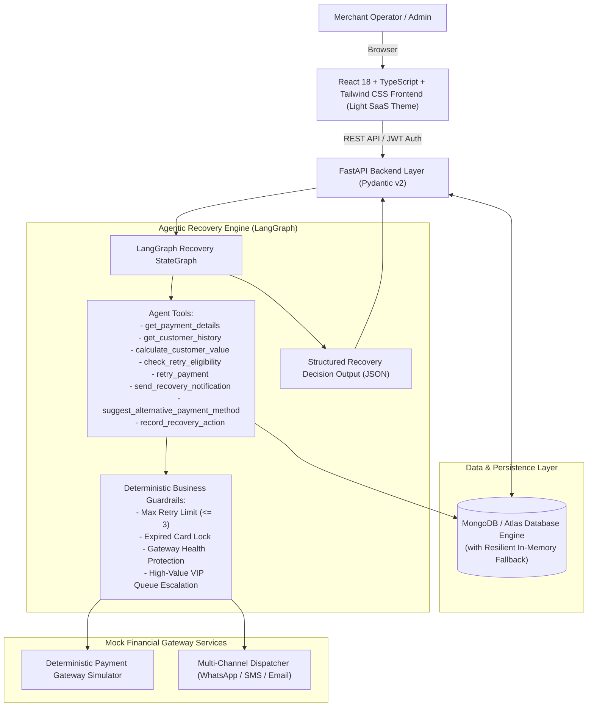
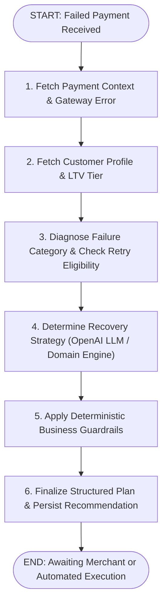

# RecoverAI — Agentic Payment Revenue Recovery Platform

> **Razorpay AI Builder Internship Portfolio Project** — *AI Revenue Recovery Track*

RecoverAI is a production-grade fintech web platform that empowers online merchants to recover lost revenue from failed payments using an autonomous **LangGraph AI Recovery Agent** governed by **deterministic business guardrails**.

📖 **[Read the Complete Technical Documentation (DOCUMENTATION.md)](./DOCUMENTATION.md)**

---

## 📌 Executive Summary & Problem Statement

When online payments fail, merchants face direct revenue loss, customer churn, and gateway friction. A single crude retry rule cannot handle the complex spectrum of transaction failures:
- **Temporary Network Glitches**: Require delayed backoff re-attempts.
- **UPI PSP/Bank Node Outages**: Direct retries fail or cause double debits; dynamic payment method switching (to Cards or NetBanking) recovers transactions instantly.
- **Card Expiration & Credential Errors**: Re-attempts will always fail; sending automated secure 1-click update links prevents drop-off.
- **Repeated Failures & Hard Limits**: Excessive retries damage merchant gateway health and trigger issuer risk flags; deterministic guardrails must halt automated charges and escalate to merchant operations.

RecoverAI solves this by analyzing **transaction context**, **customer lifetime value (LTV)**, **failure reason diagnostics**, and **historical recovery signals** in an agentic LangGraph workflow to choose and execute the highest-ROI recovery path.

---

## 🏛️ System Architecture



---

## 🤖 LangGraph Agent Workflow



---

## 💡 Key Features & Product Suite

### 1. Executive Revenue Recovery Dashboard
- **Real-Time KPIs**: Total Revenue, Recovered Revenue, Failed Payments Loss, AI Recovery Rate (%), Agent Actions Executed, and Average Recovery Velocity.
- **Interactive Recharts Visualizations**:
  - Revenue Recovered vs Failed Over Time (14-day area chart)
  - Loss Mitigation Donut Chart
  - Failures by Gateway Error Code (bar chart)
  - Recovery Success Rate by Payment Method (UPI, Card, NetBanking, Wallet)
  - AI Agent Action Breakdown distribution.

### 2. Failed Payments Queue & Filterable Workbench
- Real-time search by **Payment ID**, **Customer Name**, or **Email**.
- Multi-facet filters across **Payment Method**, **Failure Reason**, **Status**, and **Amount**.
- Immediate status badges, retry counters, and one-click access to deep diagnostic views.

### 3. Payment Deep-Dive & Interactive AI Recovery
- Comprehensive technical gateway error breakdown (error code, raw description, retry boundary status).
- Customer behavioral intelligence card (lifetime value, payment success rate %, order history).
- **"Analyze with AI"**: Triggers LangGraph agent to generate structured reasoning, confidence score, priority level, and signals analyzed.
- **"Execute Recovery"**: Simulates mock retry, WhatsApp/Email magic link dispatch, alternative payment routing, or merchant escalation, updating database records in real time.

### 4. 🌟 Recovery Strategy Simulator (Standout Feature)
- Interactive policy sandbox allowing merchants to model:
  - *Automated Smart Retries* with configurable backoff windows (5m to 120m)
  - *Max Retry Guardrail Limits* (1 to 4 attempts)
  - *Dynamic Payment Method Switching*
  - *Multi-Channel Smart Reminders* (WhatsApp, Email)
  - *VIP Priority Routing*
- Computes real-time **Net Revenue Lift ($ / ₹)**, **Simulated vs Baseline Recovery Rate**, **Unnecessary Retries Prevented**, and **Category-by-Category Financial Impact**.

### 5. 🎯 Interactive Demo Scenarios Center
Includes 5 pre-configured real-world demo cases ready for 1-click evaluation:
1. **Temporary Network Glitch** (`PAY_DEMO_001` - Aditi Sharma): Transient gateway drop $\rightarrow$ AI schedules delayed retry $\rightarrow$ 100% recovered.
2. **Expired Card Subscription** (`PAY_DEMO_002` - Neha Joshi): Expired card credentials $\rightarrow$ Guardrail halts retry $\rightarrow$ AI dispatches secure card-update portal link.
3. **UPI PSP Outage** (`PAY_DEMO_003` - Siddharth Rao): Bank node latency $\rightarrow$ AI recommends switching to Card/NetBanking.
4. **High-Value VIP Basket Decline** (`PAY_DEMO_004` - Vikram Malhotra, ₹48,500): High ticket $\rightarrow$ AI promotes to `HIGH` priority with multi-channel concierge notification.
5. **Repeated Failure / Retry Exhaustion** (`PAY_DEMO_005` - Simran Gill, 3 retries): Retry limit reached $\rightarrow$ Deterministic guardrail locks charges and escalates to Merchant Operations.

### 6. Live AI Agent Audit Feed
- Chronological, transparent feed of all agent decisions, confidence levels, decision rationales, and execution results.

---

## 🛠️ Tech Stack

| Layer | Technologies |
| :--- | :--- |
| **Frontend** | React 18, TypeScript, Vite, Tailwind CSS v4, Lucide React, Recharts, React Router v7 |
| **Backend** | Python 3.10+, FastAPI, Pydantic v2, Uvicorn, Motor, PyMongo, Python-JOSE |
| **AI / Orchestration** | LangGraph, OpenAI API (`gpt-4o-mini`) + Contextual Domain Decision Engine |
| **Database** | MongoDB / MongoDB Atlas (with seamless built-in In-Memory fallback for zero setup) |
| **Testing** | Pytest, Pytest-AsyncIO, HTTPX |

---

## 📦 Database Schemas

### `customers` Collection
```json
{
  "customer_id": "CUST_1001",
  "name": "Aditi Sharma",
  "email": "aditi.sharma@techcorp.io",
  "customer_segment": "HIGH_VALUE",
  "preferred_payment_method": "CARD",
  "lifetime_value": 245000.0,
  "total_transactions": 48,
  "successful_transactions": 45,
  "failed_transactions": 3,
  "risk_score": 0.05,
  "created_at": "2025-11-12T00:00:00Z"
}
```

### `payments` Collection
```json
{
  "payment_id": "PAY_DEMO_001",
  "customer_id": "CUST_1001",
  "amount": 14500.0,
  "currency": "INR",
  "payment_method": "CARD",
  "status": "FAILED",
  "failure_reason": "NETWORK_ERROR",
  "gateway_error_code": "GATEWAY_TIMEOUT_504",
  "gateway_error_description": "Upstream payment gateway connection timed out during TLS handshake.",
  "created_at": "2026-08-23T21:00:00Z",
  "retry_count": 0,
  "recovered": false,
  "recovery_status": "UNPROCESSED"
}
```

### `recovery_attempts` Collection
```json
{
  "recovery_id": "REC_PAY_DEMO_001_01",
  "payment_id": "PAY_DEMO_001",
  "customer_id": "CUST_1001",
  "action": "RETRY_AFTER_DELAY",
  "status": "SUCCESS",
  "timestamp": "2026-08-23T21:30:00Z",
  "agent_confidence": 0.94,
  "reason": "Temporary network timeout for high-success customer.",
  "result": "Payment successfully recovered via delayed retry.",
  "guardrail_applied": false
}
```

---

## 🚀 Running Locally

### 1. Prerequisites
- Python 3.10 or higher
- Node.js v18+ and npm (`npm.cmd` on Windows)

### 2. Backend Setup
```bash
cd backend

# Install dependencies
python -m pip install -r requirements.txt

# Run automated tests
python -m pytest

# Start FastAPI server (Runs on http://localhost:8000)
python run.py
```

### 3. Frontend Setup
```bash
cd frontend

# Note: On Windows PowerShell, use npm.cmd
npm.cmd install

# Start Vite development server (Runs on http://localhost:5173)
npm.cmd run dev
```

Visit **http://localhost:5173** to access RecoverAI.

---

## 🔑 Environment Variables

Create `.env` in `backend/`:
```env
PROJECT_NAME="RecoverAI — Agentic Payment Revenue Recovery Platform"
DATABASE_URL="mongodb://localhost:27017"
DATABASE_NAME="recoverai"

JWT_SECRET="recoverai_razorpay_secret_key_2026_production"
ALGORITHM="HS256"
ACCESS_TOKEN_EXPIRE_MINUTES=1440

# Optional: Add your OpenAI API key for live GPT-4o-mini LangGraph node.
# When omitted, RecoverAI automatically runs the built-in intelligent contextual domain engine.
OPENAI_API_KEY=""
OPENAI_MODEL="gpt-4o-mini"

DEMO_MODE=True
MAX_RETRY_LIMIT=3
```

---

## 🌐 API Overview

| Method | Endpoint | Description |
| :--- | :--- | :--- |
| `POST` | `/api/auth/login` | JWT login & demo account token issuance |
| `GET` | `/api/dashboard/metrics` | Portfolio revenue and recovery KPIs |
| `GET` | `/api/dashboard/charts` | Chart feeds for all 5 Recharts visualizations |
| `GET` | `/api/payments` | Paginated payments with multi-filter & search |
| `GET` | `/api/payments/{id}` | Full payment detail + customer profile + recovery log |
| `GET` | `/api/payments/{id}/timeline` | Transaction lifecycle audit events |
| `POST` | `/api/ai/analyze-payment` | Triggers LangGraph Recovery Agent |
| `POST` | `/api/recovery/execute` | Executes simulated recovery action & updates state |
| `POST` | `/api/simulator/run` | Strategy Simulator policy sandbox computation |
| `GET` | `/api/demo/scenarios` | List 5 predefined demo scenarios |
| `POST` | `/api/demo/trigger/{id}` | Resets demo scenario payment for live presentation |
| `GET` | `/api/agent/activity` | Live stream of all AI agent actions |

Interactive OpenAPI documentation is available at `http://localhost:8000/docs`.

---

## 🛡️ Responsible AI & Guardrails Architecture

The AI agent does not directly execute unilateral financial operations without constraints. Deterministic business rules act as safety guardrails around the model:
1. **Max Retry Boundary**: If `retry_count >= 3`, hard guardrail overrides any retry recommendation to `ESCALATE_TO_MERCHANT`, preventing payment gateway rate limiting or fines.
2. **Expired/Invalid Credential Lock**: If card expiration is detected, automated retries are permanently blocked and `REQUEST_PAYMENT_METHOD_UPDATE` is enforced.
3. **VIP Customer Protection**: High-value transactions ($\ge \text{₹}25,000$) or VIP tier customers are elevated to `HIGH` priority with proactive multi-channel concierge links.
4. **Transient Outage Protection**: UPI network timeouts route to alternative payment methods (Card/NetBanking) rather than repetitive retries on degraded bank nodes.

---

## ⚠️ Simulation Disclaimer
*All payment operations, gateway error codes, customer notifications, and recovery transactions in RecoverAI are simulated for demonstration and portfolio evaluation purposes. No real credit card or bank account charges are processed.*

---

## 🚢 Deployment Ready

- **Frontend**: Deployable to **Vercel** (`npm run build` generates clean standalone static assets in `frontend/dist`).
- **Backend**: Deployable to **Render**, **Railway**, or **AWS ECS** (`uvicorn app.main:app --host 0.0.0.0 --port $PORT`).
- **Database**: Works out-of-the-box with **MongoDB Atlas** connection URIs, with built-in zero-dependency fallback for local sandbox testing.
